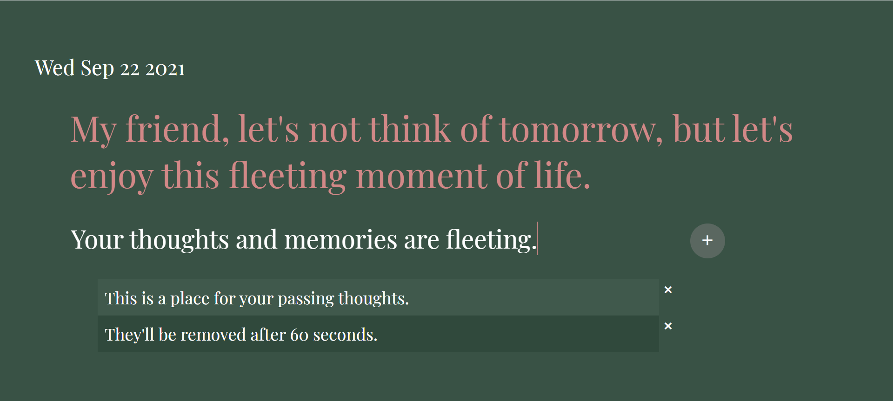

# Fleeting

## Premise

What if you could post something and know it wouldn’t live forever? In this project, you’ll build a React app for our passing thoughts. Once you add a short thought, it’ll disappear after just 60 seconds.

## Version 1

Upon accessing the page, the user is met with a brief message and a text input bar.

The user can enter any message that has a character count below 280.

Upon submission (either via <em>Enter</em> or the <em>Add</em> button). The message will be added to an array that will store the non-expired messages for 60 seconds. 

The user can either delete the messages held in the holding array or wait for the message to self delete. The self-deletion is accomplished via using a setTimeout function that removes the expired message and triggers a state update. There is not permanence feature in the app, and all messages will eventually disappear.

